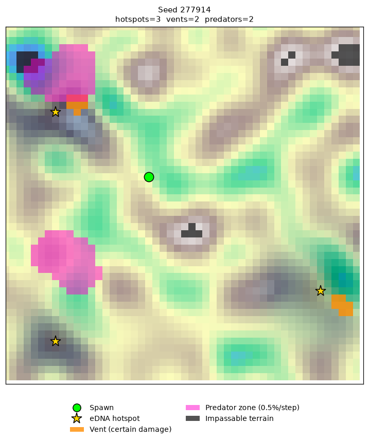

# Underwater Robot RL — Seafloor eDNA Survey Agent

A reinforcement learning agent that controls a simulated underwater robot tasked with
surveying a seafloor to find and collect eDNA (environmental DNA) samples which is a real
marine-biology technique for detecting species presence without ever finding the
organism itself.

The agent has to search under an energy budget, weigh risk against reward around
hazards, and make it back to its starting point with whatever it's collected — this is a round-trip planning problem.

## Various advancements that I made

This project's real was diagnosing why training kept failing, and fixing the actual root causes instead of
just tuning hyperparameters. A few examples:

- **Reward hacking**: the agent discovered it could earn most of the "successful
  mission" reward by stepping one tile out of spawn and immediately back in, without
  ever attempting the actual task. Fixed by restructuring the reward so most of the
  value has to come from real task progress.
- **A silent reward-shaping bug**: a dense guidance signal ("getting closer to the
  target") had its discount factor hardcoded separately from the actual training
  algorithm's discount factor. Once they drifted apart, the agent could bank real
  reward just by lingering near (not reaching) a target until timeout.
- **Policy collapse**: entropy (a measure of how much the policy is still exploring
  vs. committed to one behavior) would either get stuck near-maximum forever (never
  learns anything) or crash to near-zero on a fixed, useless behavior (e.g. walking in
  a straight line into a wall for the entire episode), depending on how exploration was
  scheduled over training.
- **Catastrophic forgetting under curriculum learning**: ramping task difficulty up
  monotonically caused the agent to lose an already-learned skill once the "easy"
  version of the task stopped appearing in training. Fixed by mixing difficulty levels
  instead of a one-way ramp.

See [`REWARDS.md`](./REWARDS.md) for the full, current reward function reference.

## How it works

- **Environment**: a procedurally generated 50×50 grid — Perlin-noise terrain, 3-5
  eDNA hotspots per episode (Gaussian concentration fields), thermal vents (instant
  death, placed with deliberate risk/reward proximity to hotspots), predator zones
  (probabilistic risk), and a limited energy budget that must cover the full round trip.

  

- **Algorithm**: Proximal Policy Optimization (PPO), implemented from scratch in
  PyTorch — not a library — specifically to demonstrate understanding of the
  algorithm's actual mechanics (clipped surrogate objective, GAE, entropy
  regularization, separate actor/critic networks).
- **Network**: a small CNN (~250-470K params) encodes the 5-channel map stack
  (elevation, eDNA concentration, vent mask, predator mask, sampled-mask) into a
  policy and value estimate.
- **Safety**: known-lethal moves (stepping directly onto a visible hazard) are
  structurally blocked via action masking, rather than left for the policy to
  hopefully learn to avoid through penalties alone.
- **Curriculum learning**: hotspot distance from spawn starts close and widens over
  training, with entropy decay and curriculum difficulty deliberately decoupled to
  avoid the forgetting failure mode above.

## Setup

```bash
python -m venv venv
source venv/bin/activate        # Windows: venv\Scripts\activate
pip install -r requirements.txt
```

## Usage

Train from scratch:
```bash
python train.py                 # full run (500k steps)
python train.py --fast-test     # shorter proxy run, for quickly checking a change
```

Watch a trained checkpoint's behavior:
```bash
python visualize_rollout.py --checkpoint checkpoints/ppo_step500000_final.pt --seed 7 --deterministic
```

Check how survivable the environment actually is, independent of any trained policy:
```bash
python diagnostics/test_survivability.py
```

## Status

The agent reliably avoids hazards and returns home
safely, but hasn't yet consistently learned to locate and sample hotspots along the
way. See `REWARDS.md` and the training logs for the current state of that work.
